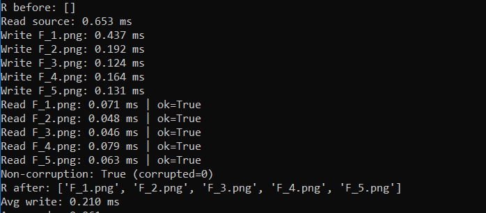
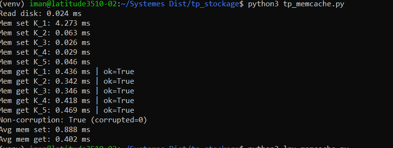
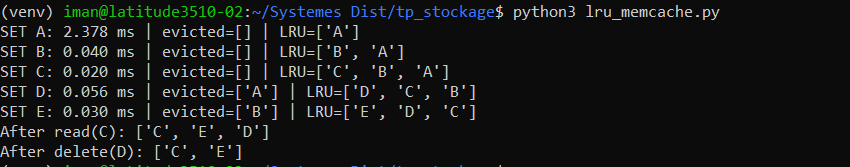

TP Stockage – FS, Memcached et LRU
==================================

**Iman ALHAJJ – FISE26**

Objectif du TP
--------------

L’objectif de ce TP est d’étudier et de comparer :

*   Un stockage sur système de fichiers (File System – FS)
    
*   Un stockage en mémoire avec Memcached
    
*   Une politique d’éviction de type LRU (Least Recently Used)
    

L’analyse porte principalement sur les performances (temps d’accès) et sur l’intégrité des données après lecture/écriture.

1\. Partie FS (File System)
===========================

Description
-----------

Le programme effectue les opérations suivantes :

*   Lecture d’une image image.png depuis le disque
    
*   Création de 5 copies (F\_1.png à F\_5.png) dans un répertoire R
    
*   Relecture de chaque copie
        
*   Calcul des temps moyens de lecture et d’écriture
    

Résultats
---------

    

Analyse
-------

Les temps mesurés sont très faibles. Cela s’explique probablement par l’utilisation du cache du système d’exploitation. Une fois le fichier lu une première fois, les accès suivants sont servis depuis la mémoire cache plutôt que directement depuis le disque physique.

L’écriture reste légèrement plus coûteuse que la lecture, ce qui est cohérent avec le fonctionnement d’un système de fichiers.

L’intégrité des données est vérifiée avec succès pour toutes les copies, ce qui confirme le bon fonctionnement des opérations de lecture et d’écriture.

2\. Partie Memcached
====================

Description
-----------

Le programme réalise :

*   Lecture de l’image depuis le disque
    
*   Stockage de l’image sous 5 clés (K\_1 à K\_5) dans Memcached
    
*   Lecture des données depuis Memcached
        
*   Calcul des temps moyens
    

Résultats
---------

    

Analyse
-------

Les opérations mem get sont plus rapides que mem set, ce qui est attendu. L’écriture nécessite davantage d’opérations internes (allocation, transfert des données), alors que la lecture correspond principalement à une récupération en mémoire.

Le premier set est plus lent (environ 4 ms), probablement en raison du coût initial de connexion ou d’initialisation de la communication TCP avec le serveur Memcached.

Dans l’ensemble, les performances sont très bonnes, ce qui confirme l’intérêt d’un stockage en mémoire pour des accès rapides et que Memcached offre de meilleures performances que le disque en conditions normales. 

3\. Partie LRU + Memcached
==========================

Configuration
-------------

*   Capacité maximale : N = 3
    
*   Suppression automatique : M = 1 élément lorsque la capacité est dépassée
    
*   Insertion successive des clés : A, B, C, D, E
    

Résultats observés
------------------

    

Analyse
-------

Le comportement observé correspond exactement à une politique LRU :

*   Lorsque la capacité maximale est atteinte, l’élément le moins récemment utilisé est évincé.
    
*   Une lecture d’un élément le repositionne en tête de la liste (plus récemment utilisé).
        

La synchronisation entre la structure LRU et Memcached est correctement réalisée et l’implémentation de la politique LRU est correcte et respecte le comportement attendu.

Conclusion Générale
===================

Ce TP m’a permis de comparer différents modes d’accès aux données : l’accès disque avec le système de fichiers et l’accès mémoire avec Memcached.

L’accès via le système de fichiers reste dépendant du stockage physique, même si les temps mesurés sont faibles grâce au cache du système. À l’inverse, Memcached permet un accès plus rapide car les données sont directement en mémoire.

L’ajout de la politique LRU montre l’importance de gérer efficacement la mémoire en supprimant les éléments les moins récemment utilisés lorsque la capacité est dépassée.

Globalement, les résultats obtenus sont cohérents et illustrent bien l’impact du mode d’accès sur les performances d’un système.